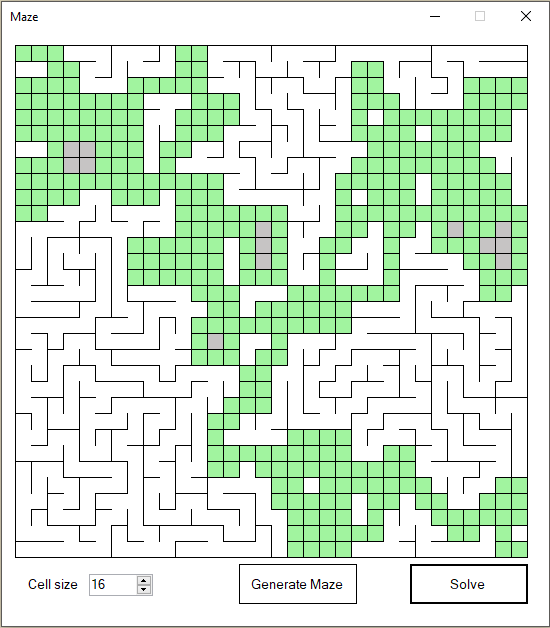

# Maze Generation and solving

A Perfect Maze generator using the recursive backtracking method to generate and solve the maze.
Built primarily from the algorithm description found at: https://en.wikipedia.org/wiki/Maze_generation_algorithm#Recursive_backtracker

## Build

<a href="https://github.com/kellybs1/Maze/blob/master/Build/kellybs1Maze.exe?raw=true">/Build/kellybs1Maze.exe</a>

## Source

<a href="https://github.com/kellybs1/Maze/tree/master/kellybs1Maze">/Maze</a>

## Algorithm description:
The individual Boid calculates its velocity based on three basic factors:
1) Cohesion - The Boid steers towards the average position of all neighbouring Boids.
2) Alignment - The Boid steers to maintain the average velocity of neighbouring Boids.
3) Separation - The Boid steers away from neighbouring Boids if it is too close.

Different weightings are applied to the three values to modify the behaviour of the flock.
    
Each cycle of the program, each Boids updates which Boids are its neighbours, then goe through the process of updating its velocity based on the three basic factors.

## Screenshot

